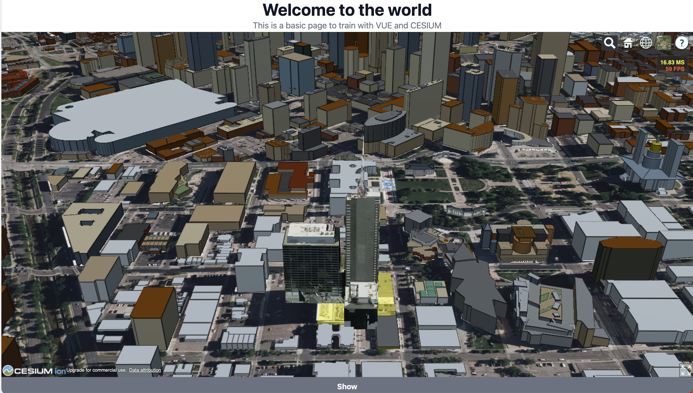

<br/>
<p align="center">
  <a href="https://github.com/Jesuisleon/Vue-2-and-Cesium-JS-Demo">
    
  </a>

  <h3 align="center">VUE 2 / CESIUM.JS</h3>

  <p align="center">
    Explore the power of Vue 2 and Cesium JS with this demo code.
    <br/>
    <br/>
    [View demo](https://vue-2-and-cesium-js-demo.vercel.app/)
  </p>
</p>


## About The Project



This repository contains sample code for a demo of Vue 2 and Cesium JS. 
The demo code demonstrates how to integrate these two powerful JavaScript libraries to create interactive, 3D geospatial applications. The code includes a Vue component that embeds a Cesium JS 3D globe, and showcases how to use Vue data binding to update the globe's properties based on user input. 

Use this repository as a starting point to build your own 3D geospatial applications with Vue 2 and Cesium JS.

## Built With

* [Vue2](https://v2.vuejs.org/)
* [CesiumJs](https://cesium.com/)
* [TailwindCSS](https://tailwindcss.com/)


### Installation

1. Get a free API Key when you register on Cesium

2. Clone the repo

```sh
git clone https://github.com/Jesuisleon/Vue-2-and-Cesium-JS-Demo
```

3. Install NPM packages

```sh
pnpm i / npm i
```

4. Enter your API in `CesiumViewer.vue` on components Folder

```JS
Ion.defaultAccessToken = 'ENTER YOUR API';
```

5. Compiles and hot-reloads for development

```sh
pnpm run serve / npm run serve
```

6. Compiles and minifies for production 

```sh
pnpm run build / npm run build
```

## Authors

* **Jesuisleon** - *creator* - [Jesuisleon](https://github.com/Jesuisleon) - *Built ReadME Template*

